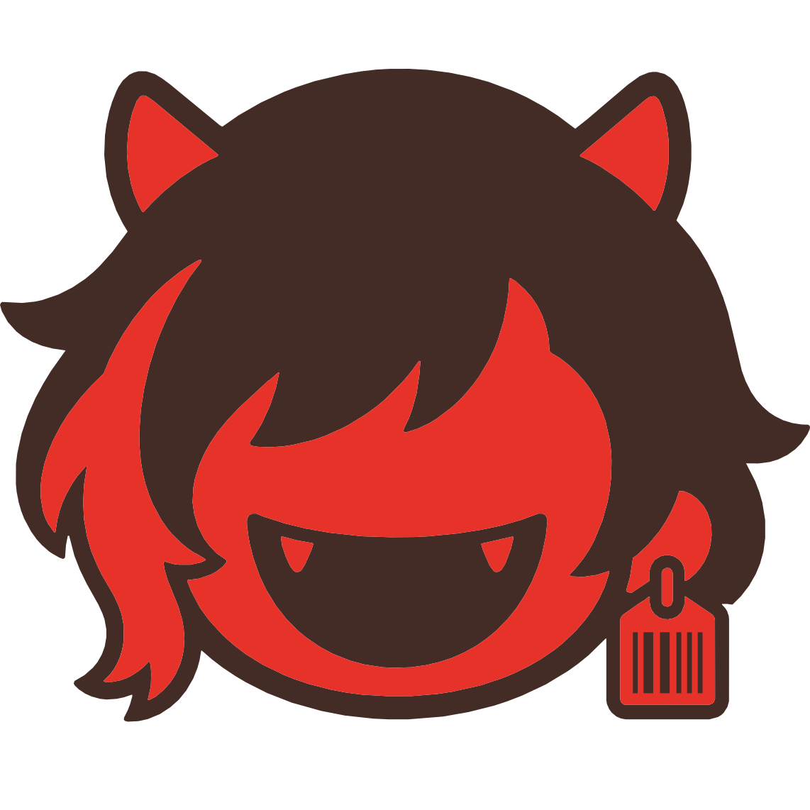

### [English](../README.md) | [日本語](README_ja.md) | [繁體中文](README_zh-TW.md) | [简体中文](README_zh-CN.md) | [Español](README_es-419.md) | Português (Brasil) | [Tiếng Việt](README_vi.md)

<!-- Language switcher slots for the language-expansion target locales.
     Each entry joins the switcher row above when its translated README lands as
     .github/README_<code>.md. Entries stay unlinked until then so the repository front page never
     carries a broken link. Labels are the endonyms from src/constants/docsLocales.ts.
     Planned: fr Français | ru Русский | ko 한국어
     See docs/en/contributing/adding-locale/readme-and-repo.md. -->

> [!NOTE]
> Este README é uma visão geral rápida. Para a documentação completa e atualizada (guias de configuração, detalhes de recursos, informações de provedores e mais), visite **[docs.tomoribot.app](https://docs.tomoribot.app/pt-BR/)**.

<br />
<div align="center">

  <a href="https://github.com/Bredrumb/TomoriBot">
    
  </a>

<h3 align="center">TomoriBot</h3>

Um assistente de IA pessoal e sistema de RPG (role-playing) para Discord com hospedagem própria e personalizável. Possui memória, múltiplas personas, uso de ferramentas, multimodalidade e suporte a APIs/modelos locais.

<p align="center">
  <strong><a href="https://tomoribot.app/">Site Oficial</a></strong>
  &middot;
  <strong><a href="https://discord.com/oauth2/authorize?client_id=841644102059556915">Convidar TomoriBot</a></strong>
  &middot;
  <strong><a href="https://discord.gg/bjCfHm9QsB">Servidor do Discord</a></strong>
  <br />
  <a href="https://github.com/Bredrumb/TomoriBot/releases">Últimos Lançamentos</a>
  &middot;
  <a href="https://github.com/Bredrumb/TomoriBot/issues/new?template=bug-report.md">Relatar Bug</a>
  &middot;
  <a href="https://github.com/Bredrumb/TomoriBot/issues/new?template=feature-request.md">Solicitar Recurso</a>
  <br />
  <br />

[](https://github.com/Bredrumb/TomoriBot/stargazers)
[](https://github.com/Bredrumb/TomoriBot/forks)
[](https://github.com/Bredrumb/TomoriBot/issues)
[](https://github.com/Bredrumb/TomoriBot/pulls)
[](https://github.com/Bredrumb/TomoriBot/blob/main/LICENSE)


  </p>

  


<!-- PROJECT LOGO -->

[![Bun][Bun.sh]][Bun-url][![Discord.js][Discord.js]][Discord-url][![TypeScript][TypeScript.js]][TypeScript-url][![PostgreSQL][PostgreSQL.org]][PostgreSQL-url]

  
</div>

<!-- ABOUT THE PROJECT -->
## Sobre o Projeto

TomoriBot é um assistente de IA pessoal e sistema de RPG de código aberto e com hospedagem própria para Discord, inspirado no SillyTavern e no descontinuado Clyde do Discord. Ele pode ser usado como um assistente prático, companheiro personalizável e parceiro de role-play para você em DMs, ou para todos no seu servidor do Discord.

TomoriBot suporta memória de longo prazo, comportamento de múltiplas personas, ferramentas web e MCP, geração de mídia no chat, mais de 200 comandos slash do Discord e múltiplos provedores, incluindo proxies personalizados e hospedagem própria de seus próprios modelos para tudo, desde geração de texto até geração de vídeo.

### Como Começar

Você pode [convidar a TomoriBot pública](https://discord.com/oauth2/authorize?client_id=841644102059556915) para o seu servidor do Discord, ou [hospedar sua própria instância](#hospedagem-própria) se preferir controle total sobre sua privacidade e chaves de API. A TomoriBot usa as melhores práticas de segurança e criptografia para manter os dados seguros, mas a hospedagem própria garante que todos os dados permaneçam inteiramente no seu dispositivo.

Após adicioná-la ao seu servidor por qualquer um dos métodos acima, execute o comando `/setup` para obter instruções. Em seguida, você pode simplesmente dizer o nome dela (ou mencioná-la com @) para obter uma resposta.

## Demonstração de Recursos


<h3 align="center"><a href="https://docs.tomoribot.app/pt-BR/features/capabilities/tools-and-extensions/">Conversação com Agente IA</a></h3>
<p align="center">A TomoriBot possui VÁRIAS ferramentas que permitem que ela vá além do simples bate-papo, como pesquisar na web, definir tarefas/lembretes recorrentes, utilizar as figurinhas do seu servidor, e opções de memória como RAG e memória de curto prazo que permitem que ela lembre do contexto entre canais e servidores.</p>

<br />


<h3 align="center"><a href="https://docs.tomoribot.app/pt-BR/features/capabilities/media-generation/">Entrada/Saída Multimodal Completa</a></h3>
<p align="center">A TomoriBot pode processar imagens, áudio e vídeo enviados diretamente no Discord e gerá-los em resposta usando seus próprios endpoints de modelo local ou chaves de API, tudo criptografado de forma segura dentro de um banco de dados persistente. Fluxos de trabalho do ComfyUI prontos para uso podem ser encontrados em <code>assets/comfyui-workflows/</code> e servidores locais de inferência de áudio em <code>servers/</code>!</p>

<br />


<h3 align="center"><a href="https://docs.tomoribot.app/pt-BR/features/chatting-personality/multiple-personas/">Suporte a Múltiplas Personas</a></h3>
<p align="center">A personalidade, o comportamento e o avatar da TomoriBot no servidor podem ser facilmente alterados, criados e exportados para outras pessoas como Personas (semelhante aos AI Character Cards compartilháveis). Importe e até mesmo transforme seus cards favoritos do SillyTavern através do comando <code>/persona generate</code>. Você pode ter uma quantidade ilimitada de personas diferentes em um único servidor, cada uma com suas próprias memórias e objetivos. Você também pode orquestrá-las para trabalharem juntas no seu servidor (ou apenas brincarem umas com as outras).</p>

<br />


<h3 align="center"><a href="https://docs.tomoribot.app/pt-BR/features/command-reference/">Mais de 200 Comandos Nativos para Configuração</a></h3>
<p align="center">Tudo pode ser gerenciado através de comandos slash nativos do Discord e UI interativa. Gerencie completamente personas, predefinições, ajuste parâmetros de modelos, configure servidores de ferramentas MCP, ajuste permissões, configure memórias, defina limites de taxa para membros do servidor e muito mais! Você também pode perguntar diretamente à TomoriBot sobre o que ela pode fazer e quais são os seus comandos slash. Atualmente, um Web Dashboard está em desenvolvimento para facilitar ainda mais o gerenciamento.</p>

<br />


<h3 align="center"><a href="https://docs.tomoribot.app/pt-BR/features/integrations/sillytavern-support/">Integração com SillyTavern (Beta)</a></h3>
<p align="center">Use suas predefinições favoritas do SillyTavern diretamente no Discord através da TomoriBot, que ajusta totalmente seu prompt, basta jogar o .json no <code>st-preset</code>. Os novos grupos de caixas de seleção nativos do Discord para modais facilitam a ativação e desativação de nós, como no SillyTavern. Você também pode importar cards de personagem do SillyTavern diretamente através do <code>/persona import</code> ou pode modificá-los antes com o <code>/persona generate</code>.</p>


<h3 align="center"><a href="https://docs.tomoribot.app/pt-BR/features/">Muitos Outros Recursos, e Contando!</a></h3>
<p align="center">Uma série de recursos divertidos que são fáceis de configurar, variando de saudações automáticas práticas para novos membros do servidor e movimento entre canais, a recursos engraçados como imitações de usuários para algumas trollagens. Novos recursos estão constantemente em desenvolvimento, então por favor reporte através das issues do GitHub ou no Discord oficial para relatar bugs (ou compartilhar sugestões divertidas).</p>

## Recursos Úteis

- [Lista Completa de Provedores Suportados](https://docs.tomoribot.app/pt-BR/features/setup-administration/providers-and-models/#provedores-suportados)
- [Como Rodar Modelos Locais](https://docs.tomoribot.app/pt-BR/self-hosting/local-endpoints/)
- [Segurança & Modelos de Ameaça](https://docs.tomoribot.app/en/wiki/threat-models/)
- [Roteiro (Roadmap) Oficial da TomoriBot](https://github.com/users/Bredrumb/projects/1/views/1)
- [Macros de Ferramenta para Personalização de Prompt](https://docs.tomoribot.app/pt-BR/features/capabilities/tools-and-extensions/)

<!-- GETTING STARTED -->
## Hospedagem Própria

Escolha um caminho de instalação:

- **A. Configuração Local com Bun (Recomendado):** requer Bun, Node.js v20+ para ferramentas MCP, e PostgreSQL ou Docker para o banco de dados.
- **B. Configuração com Docker Compose:** requer apenas o Docker para rodar o bot/banco de dados, mas scripts de manutenção do lado do host ainda precisam de ferramentas no host.

O caminho recomendado para a maioria dos auto-hospedeiros é o assistente de configuração local com Bun. O caminho padrão de **Full Install** cria `.env`, gera um `CRYPTO_SECRET` seguro, pede o token do seu bot do Discord, configura o PostgreSQL, roda `bun install --frozen-lockfile` e, em seguida, tenta instalar o banco de dados leve e extras de auxiliares de IA.

### A. Configuração Local com Bun

1. **Clone o repositório**
   ```sh
   git clone https://github.com/Bredrumb/TomoriBot.git
   cd TomoriBot
   ```

2. **Rode o assistente de configuração** (mais informações no **[Guia do Assistente de Configuração](https://docs.tomoribot.app/pt-BR/self-hosting/setup-wizard/)**)
   ```sh
   bun run setup
   ```

3. **Inicie a TomoriBot**
    ```sh
    bun run dev
    ```

Assim que você vir `TomoriBot up and running!`, execute `/setup` no Discord.

### B. Configuração com Docker Compose

O Docker Compose compila e executa a TomoriBot junto com o PostgreSQL. Ele não usa o assistente de configuração.

**Variáveis `.env` obrigatórias para Docker Compose:**
- `DISCORD_TOKEN` - Token do seu bot do Discord
- `CRYPTO_SECRET` - Chave de criptografia de 32 caracteres
- `POSTGRES_PASSWORD` - Senha do banco de dados (outras configurações do DB são autoconfiguradas)

Para o Docker Compose, inicie a partir do `.env.example`, depois adicione a `POSTGRES_PASSWORD` se você ainda não a configurou. Valores opcionais para ajustes do Docker ou do runtime ainda podem ser copiados de `.env.optional.example`.

```sh
# Compilar e iniciar a TomoriBot e o seu banco de dados
docker compose up --build
```

Para inicializações posteriores, `docker compose up` é o suficiente a menos que você tenha alterado código ou dependências.

### C. Sidecars & Servidores Opcionais

A TomoriBot suporta serviços de sidecar/servidor opcionais juntamente com qualquer um dos caminhos de instalação para aprimorar suas ferramentas e adicionar monitoramento local: SearXNG para busca web, Crawl4AI para busca em páginas renderizadas via navegador, e servidores locais de voz TTS/STT.

**Com a configuração local com Bun (A)**, use `bun run launch` em vez de `bun run dev`, exemplos de execução:

```sh
# Com os sidecars do Docker SearXNG e Crawl4AI
bun run launch --searxng --crawl4ai

# Com um servidor local TTS após seguir a documentação de configuração de voz
bun run launch --qwen3tts
bun run launch --voxcpm2
bun run launch --cosyvoice3

# Ver todas as flags disponíveis
bun run launch --help
```

Flags disponíveis: `--searxng`, `--crawl4ai`, `--qwen3tts`, `--chatterbox`, `--irodoritts`, `--voxcpm2`, `--fishs2`, `--cosyvoice3`, `--whisperx`, `--help`

**Ctrl+C** interrompe o bot e quaisquer processos de sidecar em Python. Os contêineres Docker (`--searxng`, `--crawl4ai`) são deixados intencionalmente em execução; pare-os manualmente com `docker stop searxng` / `docker stop crawl4ai` quando terminar.

**Com Docker Compose (B)**, os sidecars são habilitados via perfis no Compose:

```sh
# + SearXNG busca web (metabusca de hospedagem própria)
docker compose --profile searxng up

# + Crawl4AI busca de página renderizada em navegador
docker compose --profile fetch-crawl4ai up

# + Ambos de uma vez
docker compose --profile searxng --profile fetch-crawl4ai up
```

Consulte os guias abaixo para detalhes completos de configuração:

- **[Sidecar de Busca Web SearXNG](https://docs.tomoribot.app/pt-BR/self-hosting/local-endpoints/setup-searxng/)** - Uma instância de metabusca de hospedagem própria para contornar limites de API de mecanismo único para a ferramenta `web_search`.
- **[Sidecar Crawl4AI](https://docs.tomoribot.app/pt-BR/self-hosting/local-endpoints/setup-crawl4ai/)** - Um sidecar de renderização de navegador para buscar e processar páginas da web com muito JavaScript para a ferramenta `fetch_url`.
- **[Text-to-Speech](https://docs.tomoribot.app/pt-BR/self-hosting/local-endpoints/text-to-speech/)** / **[Speech-to-Text](https://docs.tomoribot.app/pt-BR/self-hosting/local-endpoints/speech-to-text/)** - Servidores de voz Python para as mensagens de voz da TomoriBot; o venv deles deve ser configurado uma vez com antecedência.

### Atualizando a TomoriBot

Para atualizar sua instância de hospedagem própria para a versão mais recente, pare o bot primeiro (para que o backup e quaisquer migrações rodem contra um banco de dados inativo), depois rode o atualizador com prioridade de backup:

```sh
bun run update
```

O comando roda esta sequência, parando imediatamente se qualquer etapa falhar:

1. **`bun run backup`** - tira um backup completo do banco de dados na pasta `/backups/` *antes* de mexer em qualquer código. Se o backup falhar, a atualização é abortada deixando sua implantação completamente inalterada.
2. **`git pull --rebase --autostash`**
3. **`bun install --frozen-lockfile`**

Em seguida, reinicie a TomoriBot com `bun run dev` ou `bun run launch`

Flags úteis:

| Flag | Efeito |
|---|---|
| `--build` | Também roda `bun run build` após a instalação de dependências |
| `--docker` | Caminho Docker Compose: substitui a etapa 3 por `docker compose build` + `docker compose up -d` |
| `--skip-backup` | Ignora o backup pré-atualização (não recomendado) |
| `--yes` | Pula o prompt de confirmação antes de iniciar |

Veja a **[Documentação de Manutenção](https://docs.tomoribot.app/pt-BR/features/command-reference/)** completa para mais detalhes sobre todos os scripts do lado do host.

<!-- AFTER SETUP -->
### Após Convidar / Configuração

#### Comandos Básicos

- `/setup` - Configuração inicial do bot para o seu servidor
- `/config` - Várias maneiras de ajustar a TomoriBot
- `/personal memories` - Gerencie suas memórias pessoais
- `/memories` - Gerencie memórias do servidor, documentos e memória de curto prazo
- `/moderation` - Gerencie o acesso dos membros, a lista de bloqueio de usuários, e as restrições de canais, personas e cargos

Consulte a **[Referência de Comandos](https://docs.tomoribot.app/pt-BR/features/command-reference/)** completa para todos os comandos slash.

#### Interação no Chat

Simplesmente mencione o bot em um servidor ou use as palavras-gatilho configuradas para iniciar uma conversa:
```
@TomoriBot e aí, tudo bem
```

Ou mande uma mensagem direta (DM) para a TomoriBot e diga oi!

<!-- CONTRIBUTING -->
## Contribuindo

Contribuições para a TomoriBot são muito apreciadas! Revise os recursos a seguir antes de abrir um pull request:

- **[Documentação de Contribuição](https://docs.tomoribot.app/en/contributing/)**: Guias passo a passo completos para adicionar comandos slash, ferramentas, manipuladores de eventos, novos provedores de IA e idiomas.
- **[Diretrizes de Contribuição](CONTRIBUTING.md)**: Regras do repositório cobrindo a criação de ramificações (branching), verificações de qualidade e o escopo das contribuições bem-vindas sem discussão prévia.

<!-- LEGAL -->
## Legal & Licença

### Para usuários da instância oficial hospedada da TomoriBot
- **[Termos de Serviço](https://docs.tomoribot.app/pt-BR/legal/terms-of-service/)** - Regras e diretrizes para o uso do bot
- **[Política de Privacidade](https://docs.tomoribot.app/pt-BR/legal/privacy-policy/)** - Como lidamos com seus dados

Esses documentos também estão acessíveis dentro do Discord usando os comandos `/legal terms-of-service` e `/legal privacy-policy`.

### Para usuários de hospedagem própria ou que usam forks
Você controla seus próprios dados e é responsável pela conformidade da sua implantação sob a [**GNU Affero General Public License v3.0**](https://github.com/Bredrumb/TomoriBot/blob/main/LICENSE).

<!-- CONTACT -->
## Contato & Links

**Site Oficial**: [https://tomoribot.app](https://tomoribot.app/)

**Link do Projeto**: [https://github.com/Bredrumb/TomoriBot](https://github.com/Bredrumb/TomoriBot)

**Email**: bredrumb@gmail.com

**Discord**: [Servidor Oficial de Suporte](https://discord.gg/bjCfHm9QsB)

<!-- SUPPORT -->
## Apoie o Projeto

Se você achar a TomoriBot útil e quiser apoiar o seu desenvolvimento contínuo, considere deixar uma ⭐ no GitHub ou apoiar via Ko-fi!

<p align="left">

  &nbsp;
  <a href="https://ko-fi.com/bredrumb">
    
  </a>
</p>

<!-- MARKDOWN LINKS & IMAGES -->
[TypeScript.js]: https://img.shields.io/badge/TypeScript-007ACC?style=for-the-badge&logo=typescript&logoColor=white
[TypeScript-url]: https://www.typescriptlang.org/
[Bun.sh]: https://img.shields.io/badge/Bun-f472b6?style=for-the-badge&logo=bun&logoColor=white
[Bun-url]: https://bun.sh/
[Discord.js]: https://img.shields.io/badge/Discord.js-5865F2?style=for-the-badge&logo=discord&logoColor=white
[Discord-url]: https://discord.js.org/
[PostgreSQL.org]: https://img.shields.io/badge/PostgreSQL-316192?style=for-the-badge&logo=postgresql&logoColor=white
[PostgreSQL-url]: https://www.postgresql.org/
[Google.ai]: https://img.shields.io/badge/Google%20AI-4285F4?style=for-the-badge&logo=google&logoColor=white
[Google-url]: https://ai.google.dev/
