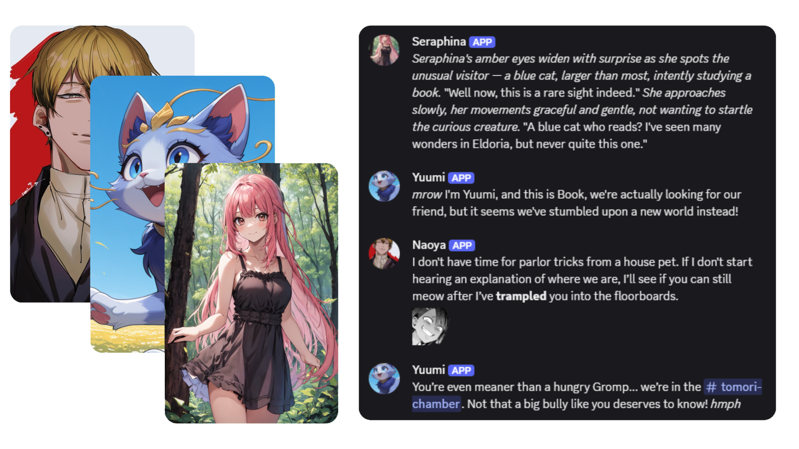
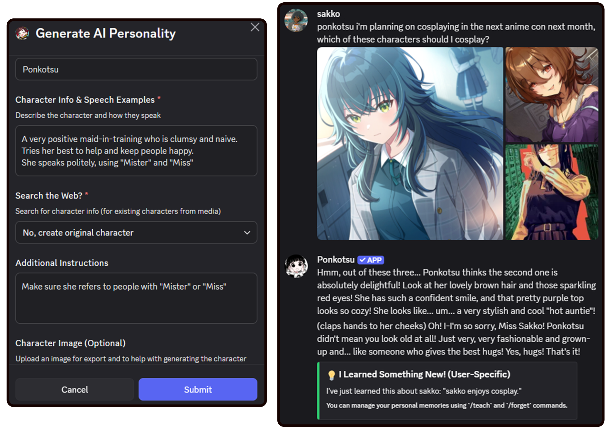
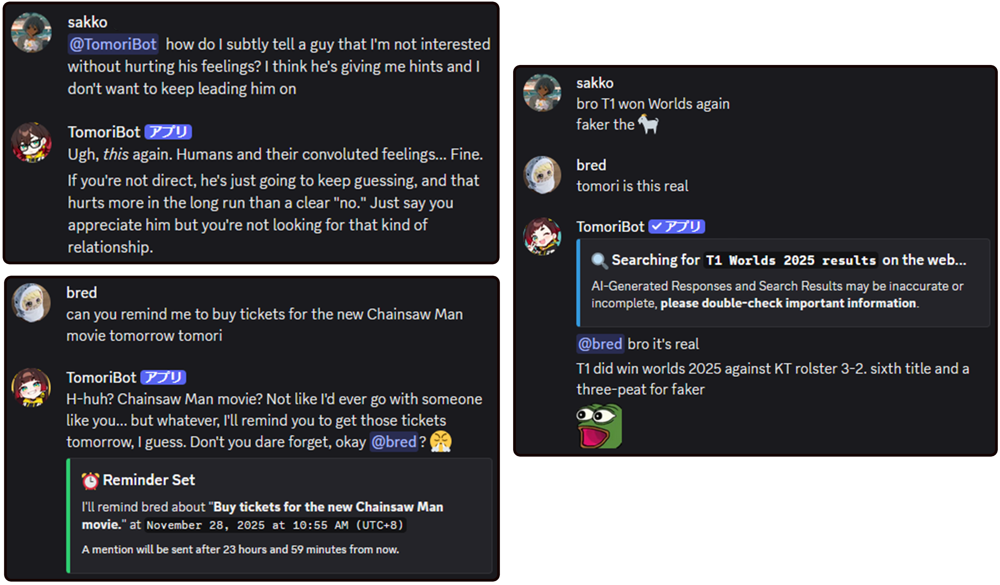
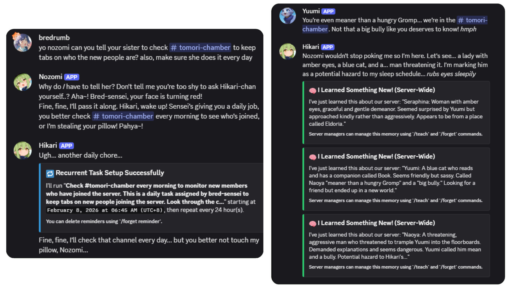
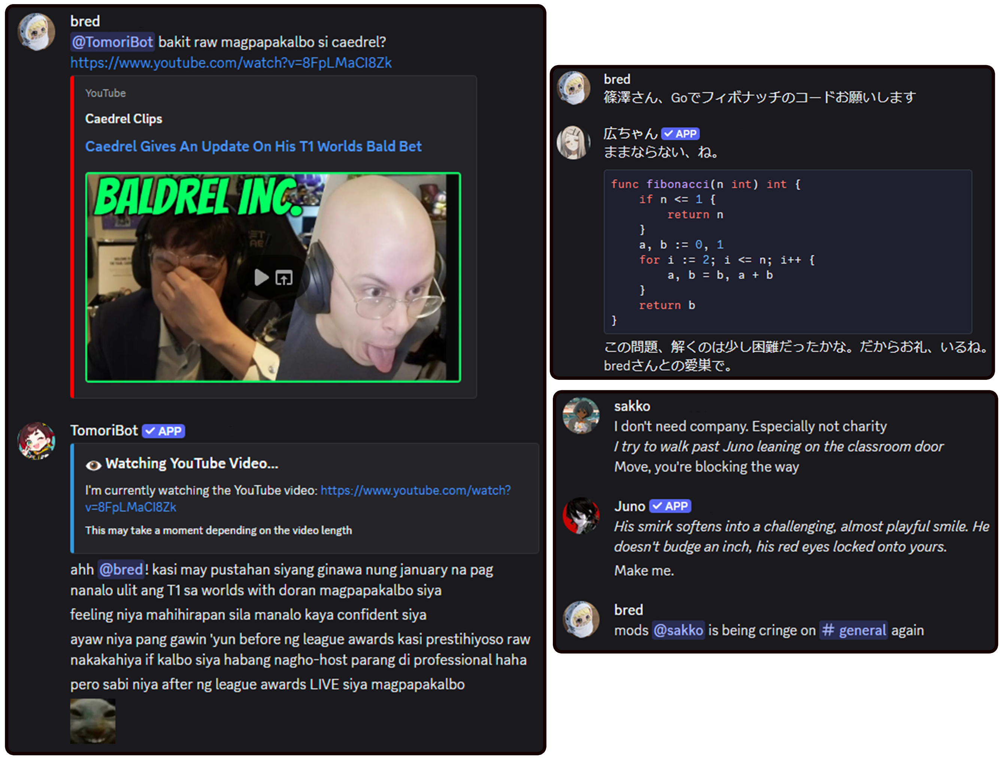
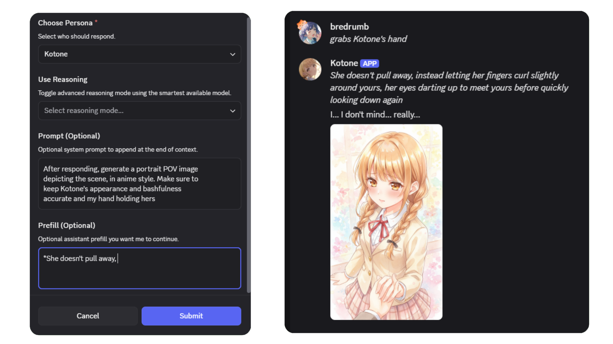
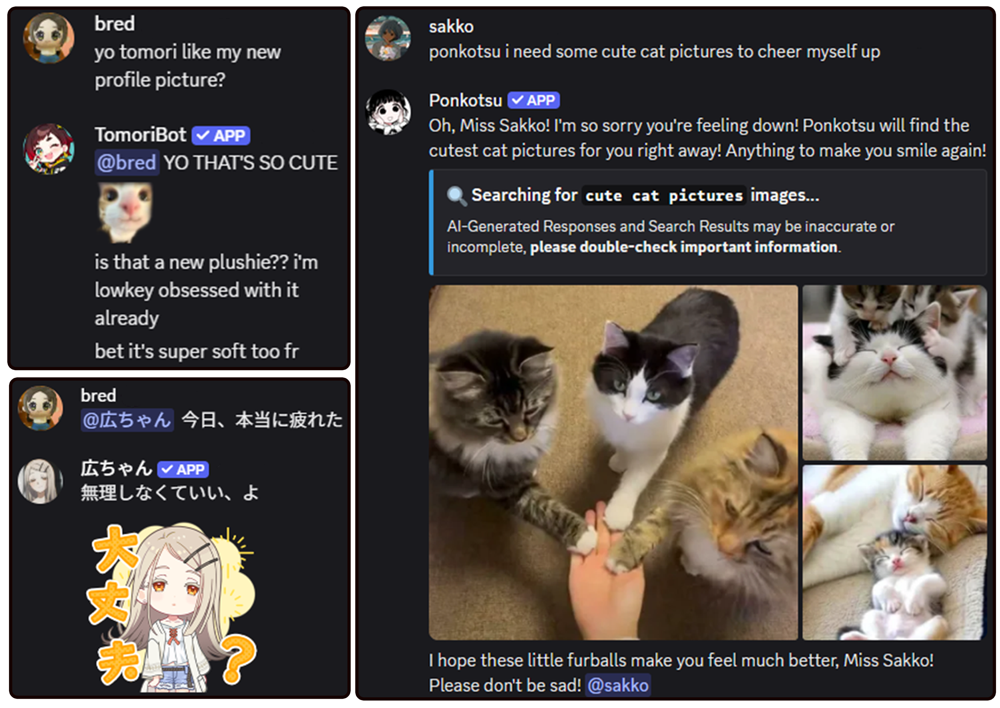

<br />
<div align="center">

  <a href="https://github.com/Bredrumb/TomoriBot">
    
  </a>

<h3 align="center">TomoriBot</h3>

A self-hosted and customizable personal AI assistant for Discord with robust memory, multiple personas, tool calling, multimodal support, and OpenAI-compatible/local model support.

<p align="center">

English | [日本語](README_ja.md)
<br />
      <br />
      <a href="https://github.com/Bredrumb/TomoriBot/releases">Latest Releases</a>
      &middot;
      <a href="https://discord.com/oauth2/authorize?client_id=841644102059556915">Invite TomoriBot</a>
      &middot;
      <a href="https://discord.gg/bjCfHm9QsB">Discord Server</a>
      &middot;
      <a href="https://github.com/Bredrumb/TomoriBot/issues/new?template=bug-report.md">Report Bug </a>
      &middot;
      <a href="https://github.com/Bredrumb/TomoriBot/issues/new?template=feature-request.md"> Request Feature</a>

[](https://github.com/Bredrumb/TomoriBot/stargazers)
[](https://github.com/Bredrumb/TomoriBot/forks)
[](https://github.com/Bredrumb/TomoriBot/issues)
[](https://github.com/Bredrumb/TomoriBot/pulls)

  </p>


<!-- PROJECT LOGO -->

[![Bun][Bun.sh]][Bun-url][![Discord.js][Discord.js]][Discord-url][![TypeScript][TypeScript.js]][TypeScript-url][![PostgreSQL][PostgreSQL.org]][PostgreSQL-url]

  
</div>


<!-- ABOUT THE PROJECT -->
## About the Project

TomoriBot is a free and open-source self-hosted personal AI assistant for Discord, inspired by [SillyTavern](https://github.com/SillyTavern/SillyTavern) and Discord's discontinued Clyde. It was created to bring both practical AI assistants and custom AI companions into Discord, with configurable memory, personas, tool usage, and model routing.

It is designed for people who want a customizable Discord AI bot, AI companion, or agentic chatbot that they can run on their own infrastructure. TomoriBot supports long-term memory, multi-persona behavior, web and MCP tools, image understanding, roleplay-oriented workflows, and multiple providers including Google Gemini, OpenRouter, NovelAI, and self-hosted OpenAI-compatible endpoints such as Ollama, KoboldCPP, vLLM, LocalAI, and ChatMock-backed setups.

You can [invite the public TomoriBot](https://discord.com/oauth2/authorize?client_id=841644102059556915) to your Discord server, or [self-host your own instance](#self-hosting) if you prefer full control over your privacy and API keys. TomoriBot uses encryption that keeps data safe, but self-hosting ensures that all data remain entirely on your device. 

After adding her to your server through either method above, run the `/config setup` command for instructions. Then you can simply say her name (or @ mention her) in order to get a response. 

## Feature Showcase





<h3 align="center">Each Server's TomoriBot is Unique</h3>
<p align="center"> 50+ slash commands are available for complete customization, including having multiple personas! TomoriBot's in-server personality, behavior, and avatar can be easily changed as well as exported for others as Personas (akin to shareable AI Character Cards). She also remembers interactions using Memories, which can only be accessed by you and your server (with complete options to delete or block for privacy) </p>

<br />





<h3 align="center">Agentic AI-Powered Conversation</h3>
<p align="center">TomoriBot has LOTS of tools that allows her to go beyond just chatting, such as searching the web, setting reminders, analyzing images, binge-watching YouTube, and utilizing your server's emotes/stickers. You can also orchestrate multiple personas to work with each other to do work in your server!</p>

<br />




<h3 align="center">Multilingual and Multi-Provider Support</h3>
<p align="center">Different AI providers and models are available (currently Google Gemini, OpenRouter, NovelAI, and locally hosted models (KoboldCPP, Ollama)), ranging from practical coding AI to role-playing AI that would power your TomoriBot's "brain". TomoriBot is also multilingual based on your chosen AI provider/model</p>

<br />





<h3 align="center">...and much MORE!</h3>
<p align="center">TomoriBot is currently in Beta, with new features such as Image Generation and role-playing tools such as prefills and impersonations! (please report through GitHub issues or the official Discord for any bugs!)</p>


<!-- GETTING STARTED -->
## Self-Hosting

This guide will help you set up TomoriBot locally for development or personal use.

### Prerequisites

Before running TomoriBot, ensure you have the following installed:

* **Node.js v20+** - Required for MCP servers (DuckDuckGo search requires the File API from Node 20+)
  ```sh
  # Check your current version
  node --version

  # If below v20, upgrade via:
  # Ubuntu/Debian
  curl -fsSL https://deb.nodesource.com/setup_20.x | sudo -E bash -
  sudo apt-get install -y nodejs

  # macOS (using Homebrew)
  brew install node@20

  # Windows (using Chocolatey)
  choco install nodejs-lts
  ```

* **Bun** - JavaScript runtime and package manager
  ```sh
  # Windows (PowerShell)
  powershell -c "irm bun.sh/install.ps1 | iex"

  # macOS/Linux
  curl -fsSL https://bun.sh/install | bash
  ```
* **PostgreSQL** - Database server
  ```sh
  # Windows (using Chocolatey)
  choco install postgresql

  # macOS (using Homebrew)
  brew install postgresql

  # Linux (Ubuntu/Debian)
  sudo apt-get install postgresql postgresql-contrib
  ```
  - After installing PostgreSQL, login:
  ```sh
  # Linux
   sudo -u postgres psql

   # macOS (Homebrew)
   psql postgres

   # Windows
   # Use "SQL Shell (psql)" from Start Menu or:
   psql -U postgres
  ```
  - Create the required database and user for TomoriBot. Replace `your_` variables with your own and take note of them:
  ```sql
  CREATE USER your_username WITH PASSWORD 'your_password' SUPERUSER;
  CREATE DATABASE your_dbname OWNER your_username;
  \q
  ```

  **Note:** The database schema (including required extensions like `pgcrypto`) is automatically initialized when you first run TomoriBot.

  **pgvector (Optional for RAG/document memory):**
  - If you want RAG features locally, install [pgvector](https://github.com/pgvector/pgvector) then run:
  ```sql
  CREATE EXTENSION vector;
  ```
  - Don't forget to set `ACTIVATE_LOCAL_RAG` as true in your .env

* **Python 3** (Optional but recommended) - Required for URL Fetching MCP server tool
  ```sh
  # Windows (using Chocolatey)
  choco install python

  # macOS (using Homebrew)
  brew install python

  # Linux (Ubuntu/Debian) - Usually pre-installed
  sudo apt-get install python3 python3-pip
  ```
  - Install MCP server packages:
  ```sh
  # Install URL fetcher for web content analysis
  pip install mcp-server-fetch

  # Linux users: If you get an "externally-managed-environment" error, use:
  pip install --break-system-packages mcp-server-fetch
  # OR create a virtual environment
  ```
### Installation

1. **Clone the repository**
   ```sh
   git clone https://github.com/Bredrumb/TomoriBot.git
   cd TomoriBot
   ```

2. **Install dependencies**
   ```sh
   bun install
   ```

### Configuration

**Create environment file** `.env` and then fill in the required variables:
   ```
    # Discord Bot Configuration (Required)
    DISCORD_TOKEN=your_discord_bot_token_here
    # Make sure your Discord bot has the following Privileged Gateway Intents:
    # GuildMembers, MessageContent, GuildPresences

    # Security (Required)
    CRYPTO_SECRET=your_32_character_crypto_secret_here

    # Database Configuration (Required)
    POSTGRES_HOST=localhost
    POSTGRES_PORT=5432
    POSTGRES_USER=your_username
    POSTGRES_PASSWORD=your_password
    POSTGRES_DB=your_dbname

    # Bot Configuration (Optional)
    DEFAULT_BOTNAME=Tomori
    DEFAULT_BOTNAME_JP=ともり
    BASE_TRIGGER_WORDS=tomori,tomo,トモリ,ともり

   ```

**Required Variables:**
- **DISCORD_TOKEN**: Your Discord bot authentication token from the [Discord Developer Portal](https://discord.com/developers/applications)
- **CRYPTO_SECRET**: A 32-character secret key for encrypting API keys stored in the database
- **POSTGRES_HOST**: PostgreSQL server hostname (default: `localhost`)
- **POSTGRES_PORT**: PostgreSQL server port (default: `5432`)
- **POSTGRES_USER**: PostgreSQL database username
- **POSTGRES_PASSWORD**: PostgreSQL database password
- **POSTGRES_DB**: PostgreSQL database name

To find all additional optional variables you can adjust, check out the `.env.example` file in the repository.

### Running TomoriBot

Once you've completed the configuration, start the bot:

```sh
# Development mode with hot reload
bun run dev
```

The bot will automatically:
- Initialize the database schema and required extensions
- Load localization files
- Connect to Discord
- Register slash commands

Once you see `TomoriBot up and running!`, without errors in your logs, the bot is online and ready to use.

#### Basic Commands

- `/config setup` - Initial bot setup for your server
- `/config` - Multiple ways to tweak TomoriBot
- `/teach` - Add memories for TomoriBot
- `/forget` - Remove memories from TomoriBot
- `/server` - Add / Remove permissions from TomoriBot

#### Chat Interaction

Simply mention the bot in a server or use the configured trigger words to start a conversation:
```
@TomoriBot yo wassup
```

Or slide into TomoriBot's DMs and say hi!

### Using Codex CLI with TomoriBot

If you want TomoriBot to use your ChatGPT account through a local OpenAI-compatible bridge, you can run [ChatMock](https://github.com/RayBytes/ChatMock) and point TomoriBot's `custom` provider at it.

#### What ChatMock does

- ChatMock runs a local OpenAI-compatible API server
- TomoriBot can use that local server through the `custom` provider

#### 1. Start ChatMock

Install and start ChatMock by following its instructions on GitHub:

- [ChatMock repository](https://github.com/RayBytes/ChatMock)

After installing, run:
```sh
chatmock login
chatmock serve
```

By default, ChatMock listens on `http://127.0.0.1:8000/v1`

#### 2. Configure TomoriBot to use ChatMock

In Discord, configure TomoriBot's `custom` provider and use:

- **Endpoint URL**: `http://127.0.0.1:8000/v1`
- **Model Name**: the exact model string ChatMock should receive, such as `gpt-5.4` or `gpt-5.3-codex`

Do **not** use bare `http://127.0.0.1:8000` because TomoriBot appends `/chat/completions` to the configured base URL

Suggested capability flags for ChatMock:

- **Function Calling / Tools**: Yes
- **Image Understanding**: Yes
- **Video Understanding**: No
- **Structured Output**: Yes

### Updating TomoriBot

Before updating, consider backing up your database (`bun run backup-db`) and reviewing the release notes.

**Manual (non-Docker) update:**
```sh
# Stop your running bot process first (Ctrl+C / service stop / pm2 stop / etc.)
git pull
bun install

# If you run from dist/ (bun run start), rebuild:
bun run build
```

**Docker Compose update:**
```sh
git pull
docker compose build
docker compose up -d
```

### Alternative: Docker Compose

If you prefer containerized deployment, you can use Docker Compose instead of manual setup:

**Required .env variables for Docker Compose:**
- `DISCORD_TOKEN` - Your Discord bot token
- `CRYPTO_SECRET` - 32-character encryption key
- `POSTGRES_PASSWORD` - Database password (other DB settings are auto-configured)

```sh
# Build TomoriBot's container (first time or after code changes)
docker compose build

# Start TomoriBot and her database (uses docker-compose.yaml)
docker compose up
```

**Note:** Docker Compose automatically configures the database connection. The PostgreSQL service runs in development mode (no SSL) and connects to the internal Docker network.

#### Monitoring with Grafana (Optional)

To monitor your TomoriBot instance with Grafana dashboards:

```sh
# Start both TomoriBot and Grafana together
docker compose -f docker-compose.yaml -f docker-compose.monitor.yaml up
```

This will:
- Launch TomoriBot with PostgreSQL (on ports 15432 for DB)
- Launch Grafana on port 3000 with auto-configured PostgreSQL datasource
- Connect both services on the same Docker network

Access Grafana at `http://localhost:3000`:
- **Username**: `admin`
- **Password**: Set via `GRAFANA_PASSWORD` in `.env` (defaults to `admin`)

The PostgreSQL datasource is automatically configured and ready to create dashboards for monitoring bot metrics, database queries, and performance.

<!-- ROADMAP -->
## Roadmap

- [x] Core AI chat functionality
- [x] Memory system implementation
- [x] Slash command structure
- [x] Multi-language Support (Locale system)
- [x] Multiple Provider Support
- [ ] TomoriBot Wiki (for local set-up and locale contributions)
- [ ] Replace AI-generated placeholder assets
- [x] Image Generation Capabilities
- [ ] Video Generation Capabilities
- [ ] KoboldCPP integration (local only)
- [ ] Voice channel integration
- [ ] Web dashboard for configuration
- [ ] Create "easy install" file for non-technical users wishing to host their own TomoriBot

See the [open issues](https://github.com/Bredrumb/TomoriBot/issues) for a full list of proposed features and known issues.

<!-- CONTRIBUTING -->
## Contributing

Since TomoriBot is still in Beta, any contributions made are **greatly appreciated**, especially for localization.

To contribute a new language translation:

1. **Create a locale file** in `src/locales/` named after a [Discord locale code](https://discord.com/developers/docs/reference#locales) (e.g., `es-ES.ts` for Spanish, `fr.ts` for French, `ko.ts` for Korean)

2. **Mirror the structure** of the gold standard file [`src/locales/en-US.ts`](src/locales/en-US.ts):
   - Copy all keys and nested objects
   - Translate all user-facing text while preserving placeholders like `{variable}`

3. **Add preset translations** (optional but recommended) in `src/db/seed.sql`:
   - Translate the `tomori_preset_desc` field for each preset
   - Translate the `preset_attribute_list`, `preset_sample_dialogues_in`, and `preset_sample_dialogues_out` arrays
   - Add LLM descriptions by translating the `llm_description` field (following the existing pattern with `ja_description`)
   - Set `preset_language` to your locale code

4. **Test your translations**:
   ```sh
   # Verify all locale keys match across files
   bun run check-locales
   ```

5. **Submit a pull request** with your new locale file(s) and any `src/db/seed.sql` additions


<!-- LEGAL -->
## Legal & License

For users of the official hosted TomoriBot instance:
- **[Terms of Service](legal/en-US/terms-of-service.md)** - Rules and guidelines for using the bot
- **[Privacy Policy](legal/en-US/privacy-policy.md)** - How we handle your data

These documents are also accessible within Discord using `/legal terms` and `/legal privacy` commands. If you're self-hosting TomoriBot, these documents serve as reference templates. You control your own data pipeline and are responsible for your deployment's compliance under the GNU Affero General Public License v3.0.

<!-- CONTACT -->
## Contact

**Project Link**: [https://github.com/Bredrumb/TomoriBot](https://github.com/Bredrumb/TomoriBot)

**Email**: bredrumb@gmail.com

**Discord**: [Official Support Server](https://discord.gg/bjCfHm9QsB)


<!-- MARKDOWN LINKS & IMAGES -->
[TypeScript.js]: https://img.shields.io/badge/TypeScript-007ACC?style=for-the-badge&logo=typescript&logoColor=white
[TypeScript-url]: https://www.typescriptlang.org/
[Bun.sh]: https://img.shields.io/badge/Bun-f472b6?style=for-the-badge&logo=bun&logoColor=white
[Bun-url]: https://bun.sh/
[Discord.js]: https://img.shields.io/badge/Discord.js-5865F2?style=for-the-badge&logo=discord&logoColor=white
[Discord-url]: https://discord.js.org/
[PostgreSQL.org]: https://img.shields.io/badge/PostgreSQL-316192?style=for-the-badge&logo=postgresql&logoColor=white
[PostgreSQL-url]: https://www.postgresql.org/
[Google.ai]: https://img.shields.io/badge/Google%20AI-4285F4?style=for-the-badge&logo=google&logoColor=white
[Google-url]: https://ai.google.dev/
