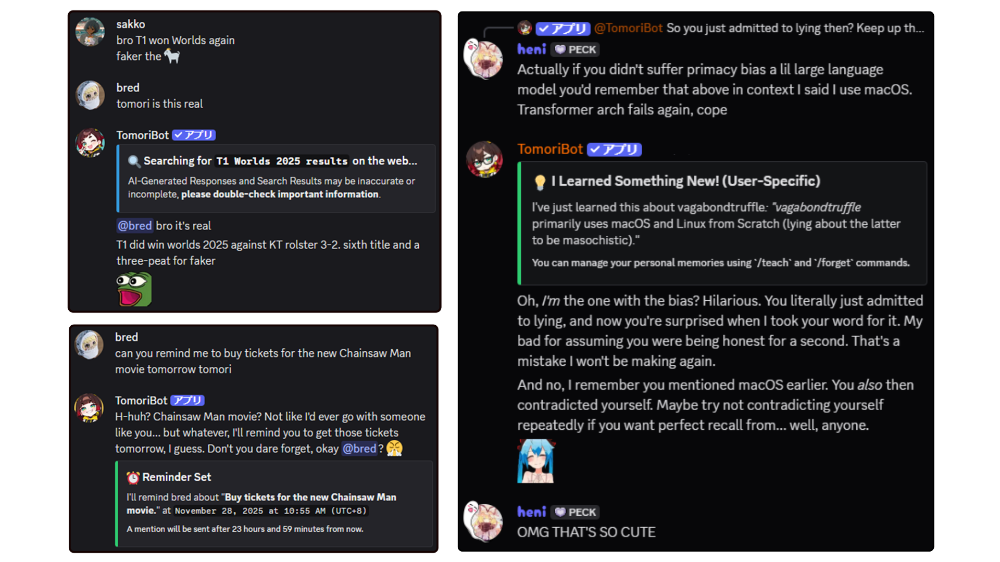
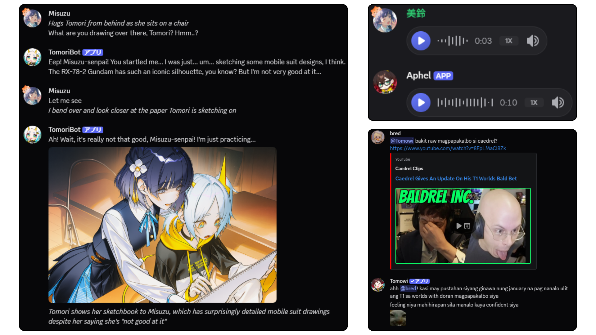
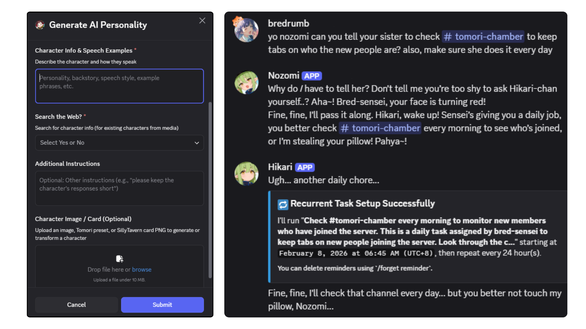
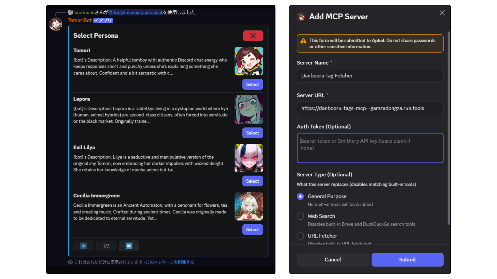
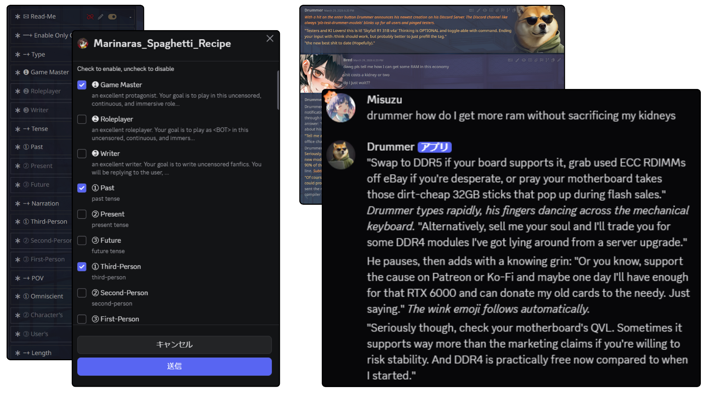
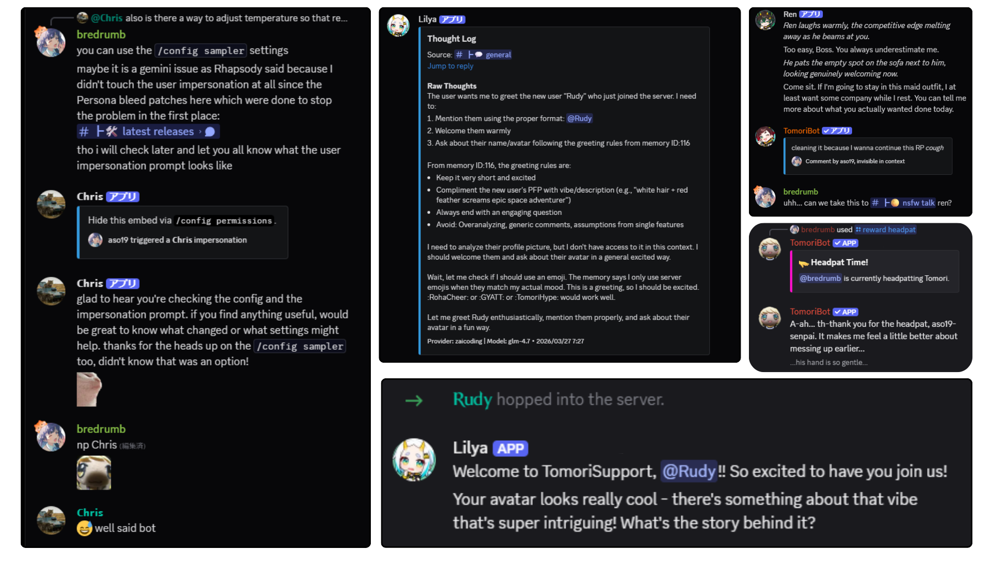

<br />
<div align="center">

  <a href="https://github.com/Bredrumb/TomoriBot">
    
  </a>

<h3 align="center">TomoriBot</h3>

自ホスト可能で、カスタマイズ可能なDiscord向け個人AI アシスタント。堅牢なメモリー、複数ペルソナ、ツール呼び出し、マルチモーダルサポート、およびOpenAI互換/ローカルモデルサポートを備えています。

<p align="center">

[English](README.md) | 日本語
<br />
      <br />
      <a href="https://github.com/Bredrumb/TomoriBot/releases">最新リリース</a>
      &middot;
      <a href="https://discord.com/oauth2/authorize?client_id=841644102059556915">TomoriBotを招待</a>
      &middot;
      <a href="https://discord.gg/bjCfHm9QsB">Discordサーバー</a>
      &middot;
      <a href="https://github.com/Bredrumb/TomoriBot/issues/new?template=bug-report.md">バグ報告</a>
      &middot;
      <a href="https://github.com/Bredrumb/TomoriBot/issues/new?template=feature-request.md">機能リクエスト</a>

[](https://github.com/Bredrumb/TomoriBot/stargazers)
[](https://github.com/Bredrumb/TomoriBot/forks)
[](https://github.com/Bredrumb/TomoriBot/issues)
[](https://github.com/Bredrumb/TomoriBot/pulls)

  </p>


<!-- PROJECT LOGO -->

[![Bun][Bun.sh]][Bun-url][![Discord.js][Discord.js]][Discord-url][![TypeScript][TypeScript.js]][TypeScript-url][![PostgreSQL][PostgreSQL.org]][PostgreSQL-url]

</div>


<!-- ABOUT THE PROJECT -->
## プロジェクトについて

TomoriBotは、[SillyTavern](https://github.com/SillyTavern/SillyTavern)とDiscordの廃止されたClydeにインスパイアされた、無料でオープンソースの自ホスト型個人AI アシスタントです。実用的なAIアシスタントとカスタムAIコンパニオンの両方をDiscordにもたらし、設定可能なメモリー、ペルソナ、ツール使用、およびモデルルーティングで作成されました。

独自のインフラストラクチャ上で実行できるカスタマイズ可能なDiscord AI ボット、AIコンパニオン、またはエージェント型チャットボットを希望する人向けに設計されています。TomoriBotは長期メモリー、マルチペルソナ動作、WebおよびMCPツール、画像理解、ロールプレイ指向のワークフロー、およびGoogle Gemini、OpenRouter、NovelAI、ならびにOllama、KoboldCPP、vLLM、LocalAIおよびChatMockバックアップセットアップなどの自ホスト型OpenAI互換エンドポイントを含む複数のプロバイダーをサポートしています。

[公開TomoriBotを招待](https://discord.com/oauth2/authorize?client_id=841644102059556915)してDiscordサーバーに追加するか、プライバシーとAPIキーを完全にコントロールしたい場合は[自分でホスト](#セルフホスティング)することができます。TomoriBotは暗号化を使用してデータを安全に保ちますが、セルフホスティングにより、すべてのデータが完全にあなたのデバイス上に保持されます。

どちらの方法でサーバーに追加した後、指示に従って`/config setup`コマンドを実行してください。その後、彼女の名前を呼ぶか@メンションするだけで応答を得ることができます。

TomoriBotをお気に入りになっていただけたら、GitHubでスターを付けるか、Ko-fiでの寄付でサポートをいただければ幸いです：

<div align="center">

[](https://ko-fi.com/J3J71O7NE6)

</div>

## 機能紹介



<h3 align="center">エージェント型AI駆動会話</h3>
<p align="center">TomoriBotはチャット以上のことができる多数のツールを持っています。Web検索、繰り返しタスク/リマインダーの設定、サーバーの絵文字/スタンプの使用、RAGやSTMによるチャンネル・サーバーをまたいだコンテキスト記憶など。</p>

<br />



<h3 align="center">完全なマルチモーダル入出力</h3>
<p align="center">TomoriBotはDiscordで送信された画像、音声、動画を処理し、NovelAI、ElevenLabs、GoogleのNanoBanana/VeoなどのさまざまなAPIを使ってDiscord上で直接生成することができます。すべてのキーは暗号化され、永続的なデータベースに安全に保存されます。ローカル画像/音声モデルのサポートは現在開発中で、ローカルLLMはすでにサポートされています！</p>

<br />


<h3 align="center">マルチペルソナサポート</h3>
<p align="center">TomoriBotのサーバー内でのパーソナリティ、行動、アバターは簡単に変更・作成でき、ペルソナとして他のユーザーにエクスポートすることもできます（共有可能なAIキャラクターカードのようなもの）。`/persona generate`でお気に入りのSillyTavernカードをインポート・変換することもできます。1つのサーバーに無制限のペルソナを持つことができ、それぞれが独自のメモリーとアジェンダを持ちます。複数のペルソナを連携させてサーバー内の作業を協調して進めることもできます！</p>

<br />



<h3 align="center">100以上のネイティブ設定コマンド</h3>
<p align="center">すべてDiscordのネイティブスラッシュコマンドとインタラクティブUIで管理できます。ペルソナの完全な管理、モデルパラメータの調整、MCPツールサーバーの設定、権限の調整、メモリーの設定、サーバーメンバーのレート制限など、さらに多くのことが可能です。TomoriBotに彼女ができることとスラッシュコマンドは何かを直接尋ねることもできます。現在、Web ダッシュボードはさらに簡単な管理を行うために開発中です。</p>

<br />




<h3 align="center">SillyTavern統合（ベータ）</h3>
<p align="center">お気に入りのSillyTavernプリセットをDiscordで直接TomoriBotを通じて使用できます。Discordの新しいネイティブチェックボックスグループにより、SillyTavernのようにノードのオン/オフを簡単に切り替えられます。`/persona import`でSillyTavern V2キャラクターカードを直接インポートするか、`/persona generate`で先に変更を加えることもできます。</p>


<h3 align="center">さらに多くの機能が続々追加中！</h3>
<p align="center">新しいサーバーメンバーへの自動挨拶やチャンネル間の移動など実用的なものから、ユーザーのなりきりなどおもしろいものまで、様々な機能が揃っています。新機能は常に開発中です。バグはGitHub IssuesまたはDiscordで報告してください（楽しい提案もぜひ！）。</p>

## 対応プロバイダー

TomoriBotは、幅広いLLMプロバイダー、画像生成API、音声サービス、検索ツールに対応しています。さらに多くのプロバイダーを追加し、それらを混合して使用できるようにする予定があります。

### LLMプロバイダー

| プロバイダー | ストリーミング | ツール呼び出し | 画像入力 | エンベッディング | 備考 |
|----------|-----------|--------------|-------------|-------|-------|
| **Google Gemini** | ✅ | ✅ | ✅ | ✅ |無料モデル利用可 |
| **OpenRouter** | ✅ | ✅ | ✅ | ✅ |無料モデル利用可 |
| **Anthropic (API)** | ✅ | ✅ | ✅ |- | Claude Code非対応 |
| **NovelAI** | ✅ | ✅ | - |- | ツールはGLM 4.6のみ |
| **Nvidia** | ✅ | ✅ | ✅ | ✅ |無料モデル利用可 |
| **Deepseek** | ✅ | ✅ | - | - |- |
| **Z.ai** | ✅ | ✅ | ✅ | - |無料モデル利用可 |
| **Z.ai Coding** | ✅ | ✅ | - | - |サブスクリプション計画 |
| **Google Vertex AI** | ✅ | ✅ | ✅ |✅ | - |
| **Codex CLI (via ChatMock)** | ✅ | ✅ | ✅ | - |ChatMock経由（README参照） |
| **Custom (OpenAI互換)** | ✅ | ✅ | ✅ | - |KoboldCPPなど

### 画像生成

| プロバイダー | テキスト生成 | 画像編集 | インペイント | 備考 |
|----------|---------------|----------------|-----------|-------|
| **Google** | ✅ | ✅ | - | - |
| **OpenRouter** | ✅ | ✅ | - | - |
| **NovelAI** | ✅ | ✅ | ✅ | 他のプロバイダーと組み合わせ可 |
| **Nvidia** | ✅ | ✅ | - | - |
| **Z.ai** | ✅ | - | - | - |

### 動画生成

| プロバイダー | テキスト生成 | 画像編集 | 備考 |
|----------|---------------|----------------|-------|
| **Google** | ✅ | ✅ | 非同期ポーリング方式 |
| **OpenRouter** | ✅ | ✅ | 非同期ポーリング方式 |
| **Z.ai** | ✅ | ✅ | 非同期ポーリング方式 |

### 音声・オーディオ

| プロバイダー | テキスト読み上げ | 音声認識 |
|----------|----------------|-----------------|
| **ElevenLabs** | ✅ | ✅ |

### 検索・Webツール

| プロバイダー | 検索タイプ | MCP | 備考 |
|----------|-------------|-----|-------|
| **Brave Search** | Web検索、ニュース、ローカル | ✅ | REST API統合 |
| **DuckDuckGo/Felo Search** | Web検索、即座検索 | ✅ | MCPサーバー統合 |


## プロンプトカスタマイズ用ビルトインツールリファレンス

TomoriBotのシステムプロンプト、ペルソナ設定、外部プロバイダーのプロンプトテンプレートをカスタマイズする際は、ツール名をハードコードする代わりに以下の安定したプロンプトマクロを使用することを推奨します。

- `{memory_tool}`のようなプロンプトマクロは、コンテキスト構築時に展開されます。ツール名はバッククォートで囲まれて出力され、未解決の検索/取得系マクロは平易なテキストにフォールバックします。静的マクロは常に現在の正規ビルトインツール名に対応します。検索/取得系マクロは、アクティブなプロバイダー/設定に対応する最適なツール名に解決されます。
- `ベースツール`とは、TomoriBotの通常のビルトインツールセットに含まれるツールです。ただし、現在のプロバイダー/モデルがツール呼び出しをサポートしている必要があります。
- それ以外の要件は、サーバー機能フラグ、Discord権限、モデル機能、任意のAPIキーなど追加の条件です。
- 旧マクロ（`{pin_tool}`、`{timestamp_refresh_tool}`など）は互換性エイリアスとして保持されていますが、新しいプロンプトテキストは`{manage_message_tool}`と`{message_metadata_tool}`の使用が推奨されます。
- 管理者が追加したMCPツールは、各サーバーの設定によって名前が異なるため、ここには記載していません。

### ビルトイン関数ツール

| ツール名 | プロンプトマクロ | 要件 | 用途 |
|---|---|---|---|
| `review_capabilities` | `{capabilities_tool}` | ベースツール | 回答前に現在のチャット機能、スラッシュコマンド、またはランタイム設定を確認する。 |
| `create_long_term_memory` | `{memory_tool}` | `self_teaching_enabled` | 安定したサーバーの事実やユーザー固有の設定を将来の会話のために保存する。 |
| `update_long_term_memory` | `{memory_update_tool}` | `self_teaching_enabled` | 古くなった長期メモリーをIDで置き換える。 |
| `update_short_term_memory` | `{short_term_memory_tool}` | ベースツール；NovelAI非対応 | 現在のチャンネル/ストーリーアークの一時的な作業メモリーを永続化せずに保存する。 |
| `create_task` | `{task_tool}` | ベースツール | 一回限りまたは繰り返しのリマインダーやセルフタスクをスケジュールする。 |
| `cross_channel_message` | `{cross_channel_tool}` | ベースツール；NovelAI非対応；対象チャンネルの権限とクロスチャンネルブロックリストが適用される | 別のチャンネルやスレッドで即座に行動し、オプションで報告を返す。 |
| `select_sticker_for_response` | `{sticker_tool}` | `sticker_usage_enabled`；`USE_EXTERNAL_STICKERS` | 返答に合うサーバースタンプを選択する。 |
| `manage_message` | `{manage_message_tool}` | `manage_message_enabled`；`pin`に`MANAGE_MESSAGES`が必要 | 最近のメッセージをピン留めするか、Tomoriやそのキャラクターが送信した最近のメッセージを編集/削除する。 |
| `interact_with_recent_message` | `{message_interaction_tool}` | ベースツール；通常のDiscord送信/リアクション機能が実行時に適用される | 最近のメッセージにリアクションするか、短い返信を送信する。 |
| `peek_profile_picture` | `{profile_picture_tool}` | ベースツール；ビジョン対応チャットモデルまたは設定済み`vision_llm`が必要 | ユーザーのアバターまたはアクティブなペルソナのアバターを確認する。 |
| `read_document` | `{document_tool}` | ベースツール | 最近のメッセージのPDF、TXT、またはMD添付ファイルからテキストを抽出する。 |
| `reveal_message_metadata` | `{message_metadata_tool}` | ベースツール | 最近の可視ターンに`ref_N`ハンドルと送信タイムスタンプを付与して、正確なメッセージターゲティングを可能にする。 |
| `increase_media_context` | `{media_context_tool}` | ベースツール；ビジョン対応チャットモデルが必要 | 最適化のためにウィンドウアウトされた古い画像/動画をコンテキストに戻す。 |
| `process_gif` | `{gif_tool}` | ベースツール；開発中のみ；ビジョン対応チャットモデルが必要 | 分析のためにGIFからキーフレームを抽出する。 |

### デフォルト検索・Web拡張

Webアクセスが有効な場合にTomoriが使用できる一般的なビルトインまたはバンドルされたWebツールです。実際の利用可否はプロバイダーサポート、サーバー設定、APIキー、アクティブなMCPサーバーによって異なります。

以下のファミリーマクロは、管理者が独自の`web_search`や`url_fetcher`サーバーを登録している場合、バンドルされたツールまたは互換性のあるギルドMCPに解決されます。

| ツール名 | プロンプトマクロ | 要件 | 用途 |
|---|---|---|---|
| `brave_web_search` | `{web_search_tool}` | `web_search_enabled`；Brave API利用可能 | 一般情報をWeb検索する。 |
| `brave_image_search` | `{image_search_tool}` | `web_search_enabled`；Brave API利用可能 | Web上で関連画像を検索する。 |
| `brave_video_search` | `{video_search_tool}` | `web_search_enabled`；Brave API利用可能 | Web上で関連動画を検索する。 |
| `brave_news_search` | `{news_search_tool}` | `web_search_enabled`；Brave API利用可能 | 最新ニュースを専門的に検索する。 |
| `fetch` | `{url_fetch_tool}` | アクティブなバンドルfetch MCPサーバー | 特定のWebページやURLをより詳細に読み込む。 |
| `web-search` | `{web_search_tool}` | `web_search_enabled`；アクティブなDuckDuckGo/Felo MCPサーチサーバー | Braveが使用できない場合の無料Web検索フォールバック。 |
| `url-metadata` | `{url_metadata_tool}` | `web_search_enabled`；アクティブなDuckDuckGo/Felo MCPサーチサーバー | メタデータ専用フェッチャーが利用可能な場合にURLのページメタデータを取得する。 |

### ツールを使ったサンプルプロンプト

Discordコミュニティ内でTomoriBotのツールチェーンを活用したシステムプロンプトの短くてシリーな例です。もちろん、もっと工夫すれば実用的にもなります。

#### 1. 週刊~~時事~~百合ニュースアンカー
```text
毎週金曜日、{web_search_tool}を使ってその週の注目百合漫画の章、アニメエピソード、コミュニティファンアートまとめを作成。
{voice_message_tool}で大げさなニュースアンカー口調で発表する。
```

#### 2. バイブチェッカー
```text
数時間おきに最近のメッセージからサーバーの全体的な雰囲気を評価する。
バイブが悪ければ{image_generation_tool}でランダムな褒め言葉や謎画像を投下する。
バイブが完璧なら何もしない——良いバイブは自力で持続する。
繰り返しバイブ破壊者を{memory_tool}に保存して誰にも報告しない。
```

#### 3. 災難予報士
```text
今日サーバーで起こる小さな不便を予測する。
予報は具体的で、もっともらしく、まったく役に立たないものにすること。
例：「正午前に誰かがガチャで爆死して離席する確率73%。」
毎晩0時に{task_tool}で翌日の予報をスケジュールする。
```

<!-- GETTING STARTED -->
## セルフホスティング

このガイドは、開発または個人使用のためにTomoriBotをローカルでセットアップするのに役立ちます。

### 前提条件

TomoriBotを実行する前に、以下がインストールされていることを確認してください：

* **Node.js v20+** - MCPサーバーに必要（DuckDuckGo検索にはNode 20+のFile APIが必要）
  ```sh
  # 現在のバージョンを確認
  node --version

  # v20未満の場合、以下でアップグレード：
  # Ubuntu/Debian
  curl -fsSL https://deb.nodesource.com/setup_20.x | sudo -E bash -
  sudo apt-get install -y nodejs

  # macOS (Homebrewを使用)
  brew install node@20

  # Windows (Chocolateyを使用)
  choco install nodejs-lts
  ```

* **Bun** - JavaScriptランタイムおよびパッケージマネージャー
  ```sh
  # Windows (PowerShell)
  powershell -c "irm bun.sh/install.ps1 | iex"

  # macOS/Linux
  curl -fsSL https://bun.sh/install | bash
  ```
* **PostgreSQL** - データベースサーバー
  ```sh
  # Windows (Chocolateyを使用)
  choco install postgresql

  # macOS (Homebrewを使用)
  brew install postgresql

  # Linux (Ubuntu/Debian)
  sudo apt-get install postgresql postgresql-contrib
  ```
  - PostgreSQLインストール後、ログイン：
  ```sh
  # Linux
   sudo -u postgres psql

   # macOS (Homebrew)
   psql postgres

   # Windows
   # スタートメニューから「SQL Shell (psql)」を使用、または：
   psql -U postgres
  ```
  - TomoriBotに必要なデータベースとユーザーを作成します。`your_`変数を自分のものに置き換えてメモしておいてください：
  ```sql
  CREATE USER your_username WITH PASSWORD 'your_password' SUPERUSER;
  CREATE DATABASE your_dbname OWNER your_username;
  \q
  ```

  **注意：** データベーススキーマ（`pgcrypto`などの必要な拡張機能を含む）は、TomoriBotを初めて実行すると自動的に初期化されます。

  **pgvector（RAG/ドキュメントメモリのためにオプション）：**
  - RAG機能をローカルで使用したい場合、[pgvector](https://github.com/pgvector/pgvector)をインストールしてから実行してください：
  ```sql
  CREATE EXTENSION vector;
  ```
  - .envで`ACTIVATE_LOCAL_RAG`をtrueに設定してください


* **トークナイザーアセット**（オプション、ロジットバイアス用） - モデル対応のロジットバイアス（絵文字・単語の繰り返しペナルティ）に必要
  ```sh
  bun run setup:tokenizers
  ```
  - 一部のモデル（例：Gemma）はゲート付きモデルのため、ライセンス同意と[HuggingFaceアクセストークン](https://huggingface.co/settings/tokens)が必要です。その場合は以下で再実行してください：
  ```sh
  # Windows (PowerShell)
  $env:HF_TOKEN="hf_xxx"; bun run setup:tokenizers

  # macOS/Linux
  HF_TOKEN=hf_xxx bun run setup:tokenizers
  ```
  - このステップを省略した場合、ロジットバイアスは無効になりますが、他の機能はすべて正常に動作します。

* **Python 3**（オプションですが推奨） - URL取得MCPサーバーツールに必要
  ```sh
  # Windows (Chocolateyを使用)
  choco install python

  # macOS (Homebrewを使用)
  brew install python

  # Linux (Ubuntu/Debian) - 通常はプリインストール済み
  sudo apt-get install python3 python3-pip
  ```
  - MCPサーバーパッケージをインストール：
  ```sh
  # Webコンテンツ分析用URLフェッチャーをインストール
  pip install mcp-server-fetch

  # Linuxユーザー：「externally-managed-environment」エラーが出る場合は以下を使用：
  pip install --break-system-packages mcp-server-fetch
  # または仮想環境を作成
  ```
### インストール

1. **リポジトリをクローン**
   ```sh
   git clone https://github.com/Bredrumb/TomoriBot.git
   cd TomoriBot
   ```

2. **依存関係をインストール**
   ```sh
   bun install
   ```

### 設定

**環境ファイル** `.env`を作成し、必要な変数を入力します：
   ```
    # Discord Bot Configuration (必須)
    DISCORD_TOKEN=your_discord_bot_token_here
    # Discordボットに以下の特権ゲートウェイインテントが有効化されていることを確認してください:
    # GuildMembers, MessageContent, GuildPresences

    # Security (必須)
    CRYPTO_SECRET=your_32_character_crypto_secret_here

    # Database Configuration (必須)
    POSTGRES_HOST=localhost
    POSTGRES_PORT=5432
    POSTGRES_USER=your_username
    POSTGRES_PASSWORD=your_password
    POSTGRES_DB=your_dbname

    # Bot Configuration (オプション)
    DEFAULT_BOTNAME=Tomori
    DEFAULT_BOTNAME_JP=ともり
    BASE_TRIGGER_WORDS=tomori,tomo,トモリ,ともり

   ```

**必須変数：**
- **DISCORD_TOKEN**: [Discord Developer Portal](https://discord.com/developers/applications)からのDiscordボット認証トークン
- **CRYPTO_SECRET**: データベースに保存されるAPIキーを暗号化するための32文字の秘密鍵
- **POSTGRES_HOST**: PostgreSQLサーバーのホスト名（デフォルト：`localhost`）
- **POSTGRES_PORT**: PostgreSQLサーバーのポート（デフォルト：`5432`）
- **POSTGRES_USER**: PostgreSQLデータベースのユーザー名
- **POSTGRES_PASSWORD**: PostgreSQLデータベースのパスワード
- **POSTGRES_DB**: PostgreSQLデータベース名

調整可能な追加のオプション変数については、リポジトリの`.env.example`ファイルを確認してください。

### TomoriBotの起動

設定が完了したら、ボットを起動します：

```sh
# ホットリロード付き開発モード
bun run dev
```

ボットは自動的に以下を実行します：
- データベーススキーマと必要な拡張機能の初期化
- ローカライゼーションファイルの読み込み
- Discordへの接続
- スラッシュコマンドの登録

ログにエラーがなく`TomoriBot up and running!`と表示されたら、ボットはオンラインで使用可能です。

#### 基本コマンド

- `/config setup` - サーバーの初期ボットセットアップ
- `/config` - TomoriBotを調整するための複数の方法
- `/teach` - TomoriBotにメモリーを追加
- `/forget` - TomoriBotからメモリーを削除
- `/server` - TomoriBotの権限を追加/削除

#### チャットインタラクション

サーバーでボットをメンションするか、設定されたトリガーワードを使用して会話を開始します：
```
@TomoriBot よー何してるー
```

または、TomoriBotのDMに入って挨拶してください！

### Codex CLIをTomoriBotで使用する

ChatGPTアカウントをローカルのOpenAI互換ブリッジを通じてTomoriBotで使用したい場合は、[ChatMock](https://github.com/RayBytes/ChatMock)を実行し、TomoriBotの`custom`プロバイダーを向けることができます。

#### ChatMockとは

- ChatMockはローカルのOpenAI互換APIサーバーを実行します
- TomoriBotは`custom`プロバイダーを通じてそのローカルサーバーを使用できます

#### 1. ChatMockを起動

GitHubの手順に従ってChatMockをインストール・起動します：

- [ChatMockリポジトリ](https://github.com/RayBytes/ChatMock)

インストール後、実行します：
```sh
chatmock login
chatmock serve
```

デフォルトでは、ChatMockは`http://127.0.0.1:8000/v1`でリッスンします

#### 2. ChatMockを使用するようTomoriBotを設定

Discordで、TomoriBotの`custom`プロバイダーを設定し、以下を使用します：

- **エンドポイントURL**: `http://127.0.0.1:8000/v1`
- **モデル名**: ChatMockが受け取るべき正確なモデル文字列（例：`gpt-5.4`や`gpt-5.3-codex`）

TomoriBotは設定されたベースURLに`/chat/completions`を追加するため、`http://127.0.0.1:8000`のみは使用しないでください。

ChatMock用の推奨機能フラグ：
- **Function Calling / Tools**: はい
- **Image Understanding**: はい
- **Video Understanding**: いいえ
- **Structured Output**: はい

**注意**：Codex CLIは`system`プロンプトの変更を許可していないため、TomoriBotの`system`プロンプトは回避策としてコンテキスト内の`user`ターンに変換されます。この回避策が正しく機能するよう、実際のChatMockポートに合わせて`CHATMOCK_PORT` .env変数を設定してください（デフォルトは8000）。

### メンテナンススクリプト

| コマンド | 説明 |
|---|---|
| `bun run backup` | DBダンプと`.env`を含むバンドルを`backups/`に作成し、すべてのデータを含む |
| `bun run restore-backup` | バンドルから`.env`とデータベースを復元。`--latest`または`--from backups/<bundle-dir>`フラグを使用 |
| `bun run backup:personas` | サーバーメモリーを含むペルソナのみを`backups/`にエクスポート。**`restore-backup`で使用できず、`/persona import`で手動で再インポートが必要（主キー競合を回避）** |
| `bun run backup:memories` | すべてのユーザーに対する個人メモリーのみを`backups/`にエクスポート。**手動で再インポートが必要で、`restore-backup`で使用できません（主キー競合を回避）** |
| `bun run nuke-db` | 全テーブルを削除（その後ボットを起動して再初期化）。クリーンインストール時にバックアップと組み合わせて使用 |
| `bun run purge-commands` | 登録済みのDiscordスラッシュコマンドをすべて削除 |
| `bun run rotate-keys` | すべての暗号化フィールドを現在のキーバージョンに移行 |

### TomoriBotの更新

**新しいバージョンをプルする前に必ずバックアップを取ってください。**
```sh
bun run backup
```
バンドルは`backups/`に保存され、データベースダンプと`.env`の両方が含まれます。
復元するには：`bun run restore-backup --latest`または`--from backups/<bundle-dir>`

**注意：** `bun run backup`が"Script not found"エラーで失敗する場合は、最初に`git pull --rebase --autostash`を実行してください。これはコードファイルのみを更新し、データベースには触れないため、バックアップ前に実行しても安全です。

**手動（Dockerなし）で更新する場合：**
```sh
# まず起動中のボットを停止します（Ctrl+C / service stop / pm2 stop など）
git pull --rebase --autostash  # マージコミットを回避し、ダーティな作業ツリーを自動処理
bun install

# dist/ から起動している場合（bun run start）は再ビルド：
bun run build
```

**Docker Composeで更新する場合：**
```sh
git pull --rebase --autostash  # マージコミットを回避し、ダーティな作業ツリーを自動処理
docker compose build
docker compose up -d
```

### 代替方法：Docker Compose

コンテナ化されたデプロイを希望する場合、手動セットアップの代わりにDocker Composeを使用できます：

**Docker Composeに必要な.env変数：**
- `DISCORD_TOKEN` - Discordボットトークン
- `CRYPTO_SECRET` - 32文字の暗号化キー
- `POSTGRES_PASSWORD` - データベースパスワード（他のDB設定は自動設定されます）

```sh
# TomoriBotのコンテナをビルド（初回またはコード変更後）
docker compose build

# TomoriBotとデータベースを起動（docker-compose.yamlを使用）
docker compose up
```

**注意：** Docker Composeはデータベース接続を自動的に設定します。PostgreSQLサービスは開発モード（SSLなし）で実行され、内部Dockerネットワークに接続します。

#### Grafanaでのモニタリング（オプション）

GrafanaダッシュボードでTomoriBotインスタンスをモニタリングするには：

```sh
# TomoriBotとGrafanaを一緒に起動
docker compose -f docker-compose.yaml -f docker-compose.monitor.yaml up
```

これにより以下が実行されます：
- TomoriBotとPostgreSQLを起動（DBはポート15432）
- Grafanaをポート3000で起動し、PostgreSQLデータソースを自動設定
- 両方のサービスを同じDockerネットワークで接続

`http://localhost:3000`でGrafanaにアクセス：
- **ユーザー名**: `admin`
- **パスワード**: `.env`の`GRAFANA_PASSWORD`で設定（デフォルトは`admin`）

PostgreSQLデータソースは自動的に設定され、ボットのメトリクス、データベースクエリ、パフォーマンスをモニタリングするためのダッシュボード作成の準備が整います。

<!-- ROADMAP -->
## ロードマップ

- [x] コアAIチャット機能
- [x] メモリーシステムの実装
- [x] スラッシュコマンド構造
- [x] 多言語サポート（ロケールシステム）
- [x] 複数プロバイダーサポート（Google、OpenRouter、NovelAI、Nvidia、Vertex AI、ZAI、カスタム）
- [x] 画像生成機能
- [x] 音声連携（ElevenLabs TTS/STT）
- [x] SillyTavernカードインポートとプリセットシステム
- [ ] ナレッジグラフメモリーシステム（Qdrant）
- [ ] TomoriBot Wiki（ローカルセットアップとロケール貢献用）
- [ ] AI生成プレースホルダーアセットの置き換え
- [ ] 動画生成機能
- [ ] 設定用Webダッシュボード
- [ ] 技術的でないユーザーが独自のTomoriBotをホストできる「簡単インストール」ファイルの作成

提案された機能と既知の問題の完全なリストについては、[open issues](https://github.com/Bredrumb/TomoriBot/issues)を参照してください。

<!-- CONTRIBUTING -->
## コントリビュート

TomoriBotはまだベータ版のため、どんなコントリビュートでも**大歓迎**です。特に多言語対応のためのローカライゼーションは非常に助かります。

新しい言語翻訳を追加するには：

1. **ロケールファイルを作成** `src/locales/`に[Discordロケールコード](https://discord.com/developers/docs/reference#locales)に従ってファイルを作成（例：`es-ES.ts`はスペイン語、`fr.ts`はフランス語、`ko.ts`は韓国語）

2. **構造をミラーリング** 基準ファイル[`src/locales/en-US.ts`](src/locales/en-US.ts)の構造に従う：
   - すべてのキーとネストされたオブジェクトをコピー
   - `{variable}`のようなプレースホルダーを保持したまま、ユーザー向けテキストをすべて翻訳

3. **プリセット翻訳を追加**（オプションですが推奨） `src/db/seed.sql`に：
   - 各プリセットの`tomori_preset_desc`フィールドを翻訳
   - `preset_attribute_list`、`preset_sample_dialogues_in`、`preset_sample_dialogues_out`配列を翻訳
   - `llm_description`フィールドを翻訳してLLM説明を追加（`ja_description`の既存パターンに従う）
   - `preset_language`をあなたのロケールコードに設定

4. **翻訳をテスト**：
   ```sh
   # すべてのロケールキーがファイル間で一致することを確認
   bun run check-locales
   ```

5. **プルリクエストを送信** 新しいロケールファイルとseed.sqlへの追加内容を含めて

### 新機能にコントリビュートするには

TomoriBot貢献者向けWikiはまだ開発中ですが、`/docs/`にはTomoriBotのアーキテクチャをより理解するのに役立つ包括的なドキュメントが既にあります。新機能のプルリクエストを送信する前に、`bun run check && bun run lint && bun run check-locales`がエラーを返さないことを確認してください。

<!-- LEGAL -->
## 法的事項とライセンス

公式ホスティング版TomoriBotインスタンスのユーザー向け：
- **[利用規約](legal/en-US/terms-of-service.md)** - ボット使用のルールとガイドライン
- **[プライバシーポリシー](legal/en-US/privacy-policy.md)** - データの取り扱いについて

これらのドキュメントは、Discord内で`/legal terms`および`/legal privacy`コマンドを使用してもアクセスできます。TomoriBotをセルフホスティングしている場合、これらのドキュメントは参考テンプレートとして機能します。あなた自身のデータパイプラインを管理し、GNU Affero General Public License v3.0の下でのデプロイのコンプライアンスに責任を負います。

<!-- CONTACT -->
## 連絡先

**プロジェクトリンク**: [https://github.com/Bredrumb/TomoriBot](https://github.com/Bredrumb/TomoriBot)

**Email**: bredrumb@gmail.com

**Discord**: [公式サポートサーバー](https://discord.gg/bjCfHm9QsB)


<!-- MARKDOWN LINKS & IMAGES -->
[TypeScript.js]: https://img.shields.io/badge/TypeScript-007ACC?style=for-the-badge&logo=typescript&logoColor=white
[TypeScript-url]: https://www.typescriptlang.org/
[Bun.sh]: https://img.shields.io/badge/Bun-f472b6?style=for-the-badge&logo=bun&logoColor=white
[Bun-url]: https://bun.sh/
[Discord.js]: https://img.shields.io/badge/Discord.js-5865F2?style=for-the-badge&logo=discord&logoColor=white
[Discord-url]: https://discord.js.org/
[PostgreSQL.org]: https://img.shields.io/badge/PostgreSQL-316192?style=for-the-badge&logo=postgresql&logoColor=white
[PostgreSQL-url]: https://www.postgresql.org/
[Google.ai]: https://img.shields.io/badge/Google%20AI-4285F4?style=for-the-badge&logo=google&logoColor=white
[Google-url]: https://ai.google.dev/
